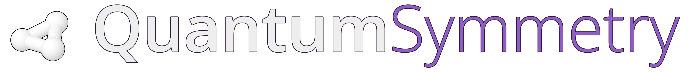

[](https://badge.fury.io/py/quantumsymmetry)

# QuantumSymmetry

QuantumSymmetry is an open-source Python package for research in molecular physics using quantum computing. It allows to encode more efficiently information about a molecular system on a quantum computer using symmetry-adapted encodings.

QuantumSymmetry uses [PySCF](https://github.com/pyscf/pyscf) to perform Hartre-Fock calculations, for the calculation of one- and two-electron integrals and the construction of symmetry-adapted molecular orbitals. It automatically retrieves from PySCF the largest Boolean symmetry group for the input molecular geometry, as well as the irreducible representation of its HF ground state.

It is compatible with both [OpenFermion](https://github.com/quantumlib/OpenFermion) and [Qiskit](https://github.com/Qiskit). QuantumSymmetry takes arbitrary user input such as the molecular geometry and the atomic basis set and allows the user to construct the qubit operators that correspond to fermionic operators on the molecular system in the appropriate symmetry-adapted encoding.

## Installation

You can install QuantumSymmetry by running the following command from terminal:
```bash
$ pip install quantumsymmetry
```

## Tutorials

Interactive tutorials on Google Colab can be found [here](https://colab.research.google.com/github/dariopicozzi/quantumsymmetry/blob/master/docs/tutorials/01_welcome.ipynb).

## How to cite

> *Picozzi, D. and Tennyson, J. (2023). Symmetry-adapted encodings for qubit number reduction by point-group and other Boolean symmetries. Quantum Science and Technology, 8(3). DOI:https://doi.org/10.1088/2058-9565/acd86c*

## Getting in touch

For any question about QuantumSymmetry or my research, don't hesitate to get in touch.

## License

QuantumSymmetry was created by Dario Picozzi. It is licensed under the terms of the GNU General Public License v3.0 license.
