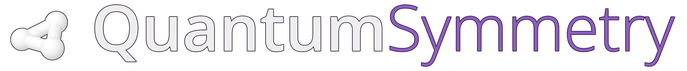

[](https://badge.fury.io/py/quantumsymmetry)

# QuantumSymmetry

QuantumSymmetry is an open-source Python package for research in molecular physics using quantum computing. It allows to encode more efficiently information about a molecular system on a quantum computer using symmetry-adapted encodings, and provides a universal hardware-efficient variational ansatz (`MinimalCircuit`) whose Fubini–Study metric is diagonal in closed form.

QuantumSymmetry uses [PySCF](https://github.com/pyscf/pyscf) to perform Hartre-Fock calculations, for the calculation of one- and two-electron integrals and the construction of symmetry-adapted molecular orbitals. It automatically retrieves from PySCF the largest Boolean symmetry group for the input molecular geometry, as well as the irreducible representation of its HF ground state.

QuantumSymmetry takes arbitrary user input such as the molecular geometry and the atomic basis set and allows the user to construct the qubit operators that correspond to fermionic operators on the molecular system in the appropriate symmetry-adapted encoding. It is compatible with both [OpenFermion](https://github.com/quantumlib/OpenFermion) and [Qiskit](https://github.com/Qiskit).

## Installation

You can install QuantumSymmetry by running the following command from terminal:

```bash
$ pip install quantumsymmetry
```

## Quickstart

In QuantumSymmetry, information about a symmetry-adapted encoding is in an `Encoding` object:

```python
from quantumsymmetry import Encoding

encoding = Encoding(
    atom = 'H 0 0 0; H 0.7414 0 0',
    basis = 'sto-3g')
```

This can be used for example to obtain the symmetry-adapted encoding qubit Hamiltonian:

```python
encoding.hamiltonian
```

## Binary-tree variational ansatz

QuantumSymmetry also provides `MinimalCircuit`, a universal hardware-efficient variational ansatz built from a binary tree of uniformly controlled rotations. Its Fubini–Study metric is diagonal in closed form, so quantum natural gradient, imaginary- and real-time evolution, and exact sector-restricted (Haar) sampling run with no auxiliary metric circuits and no matrix inversion. When the target state lives in a symmetry sector, a pruning compiler produces circuits whose two-qubit gate count grows linearly in the number of active basis states.

```python
from quantumsymmetry import MinimalCircuit

# Two spatial orbitals (4 qubits), one spin-up and one spin-down electron
mc = MinimalCircuit.from_particle_number(num_spatial_orbitals = 2, num_particles = (1, 1))

mc.circuit          # the pruned Qiskit circuit
mc.num_parameters   # number of free tree angles
```

The same object drives natural-gradient VQE (`minimize_energy`), real- and imaginary-time evolution (`evolve_realtime`), sector-Haar sampling (`sample_sector_haar`), a Schrieffer–Wolff dressing layer (`make_dressing_pool`), and exact total-spin adaptation (`MinimalCircuit.from_particle_number(..., total_spin = S)`).

## Tutorials

Interactive tutorials with code snippets are hosted on Google Colab: the [symmetry-adapted encodings series](https://colab.research.google.com/github/dariopicozzi/quantumsymmetry/blob/master/docs/tutorials/01_welcome.ipynb) and the [binary-tree ansatz series](https://colab.research.google.com/github/dariopicozzi/quantumsymmetry/blob/master/docs/tutorials/tree_01_welcome.ipynb).

## How to cite

> *Picozzi, D. and Tennyson, J. (2023). Symmetry-adapted encodings for qubit number reduction by point-group and other Boolean symmetries. Quantum Science and Technology, 8(3). DOI:https://doi.org/10.1088/2058-9565/acd86c*

## Getting in touch

For any question about QuantumSymmetry or my research, don't hesitate to get in touch.

## License

QuantumSymmetry was created by Dario Picozzi. It is licensed under the terms of the GNU General Public License v3.0 license.
